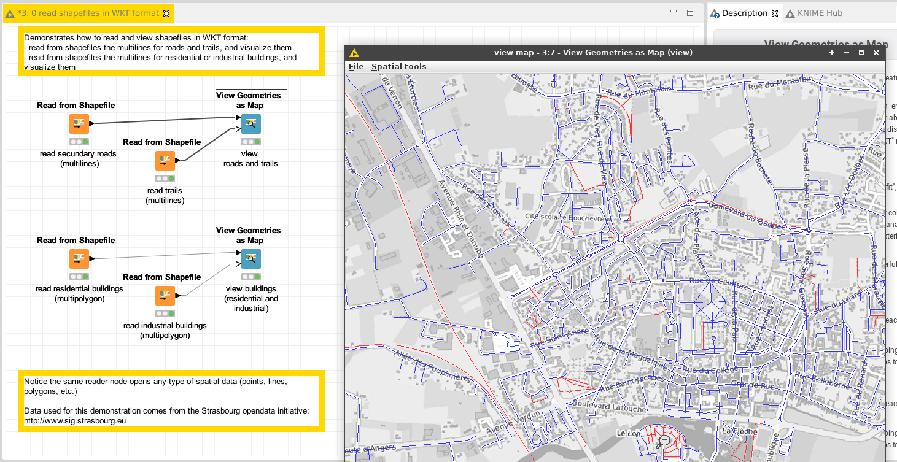

# Demo: read spatial data from Shapefiles

[Download the workflow here](0_read_shapefiles_in_WKT_format.knwf), then import it into KNIME using File/Import KNIME Workflow. 

This workflow demonstrates how to read data from the [ESRI shapefile format](https://en.wikipedia.org/wiki/Shapefile).
The node "Read shapefile as WKT" decodes the geometries and produces one row per geometry.

* open the output table of one of these nodes, and observe how the geometries are encoded in a column "the_geom"; this format is the Well-Known Text format.
* compare the outputs of the various nodes; observe how the geometries can be lines of polygons
* open the views, and watch how the "the_geom" columns of the KNIME tables were interpreted as spatial data 

# Next

See the demo on how to [merge geometries from various sources in KNIME](../../pages/1_merge_shapefiles/index.md)
