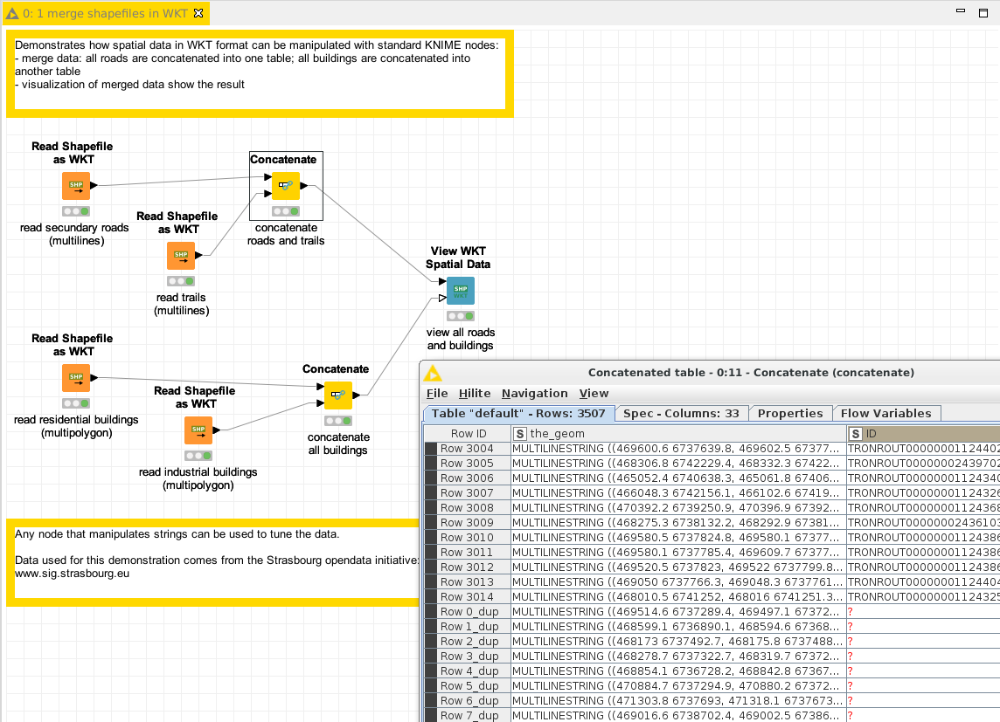

# Demo: read spatial data from Shapefiles

[Download the workflow here](1_merge_shapefiles_in_WKT.knwf), then import it into KNIME using File/Import KNIME Workflow. 

This workflow demonstrates how, when data was loaded from geometries inside KNIME, it can then me merged, joined or concatenated 
using the standard nodes. 

Here we had loaded lines for secondary road and trails; we merge both using the standard "Concatenate" node. 
We apply the same process for the geometries of residential and industrial buildings.

# Things to try

* Run the workflow
* Observe the outputs of the nodes

Note: we can merge different types of geometries within KNIME (for instance, concatenate tables containing geometries and lines), 
because KNIME only considers these values as String values. 
However most of the Spatial nodes might refuse input data which mixes geometry types. 

# Go beyond

* Add a node "Write WKT as a Shapefile" and write the result of the concatenation into a shapefile. 
