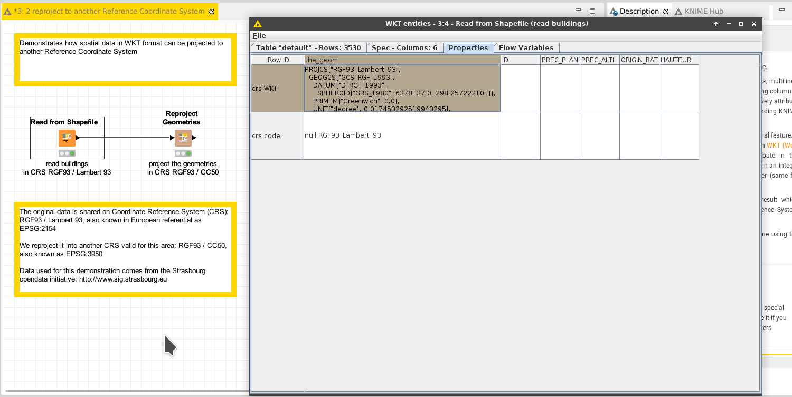

# Demo: reproject geometries

[Download the workflow here](2_reproject_to_another_Reference_Coordinate_System.knwf), then import it into KNIME using File/Import KNIME Workflow. 

Spatial data ultimately corresponds to a pile of (x,y) coordinates. They only have a geographical meaning if they are considered according to a [Coordinate Reference System](https://en.wikipedia.org/wiki/Spatial_reference_system) which defines 
where in Earth these coordinates are. Coordinate Reference Systems might cover the entire planet with limited precision and risks of distortion, or might only cover a limited portion of the globe with high accuracy.

This workflow demonstrates how to reproject the geometries.

# Things to try

* Run the workflow
* Open the outputs of each node, and compare the coordinates; watch how the geometries are the same in a different referential. 
* Add a "View WKT Spatial Data", and observe how the projection does not change what is displayed; only the referential changes
* Try to reproject to another coordinate system by tuning the configuration of the "Reproject" node; try WGS84 which covers the globe and is thus compliant with any location

# Go beyond

* Add a node "Write WKT as a Shapefile" and write the result of the concatenation into a shapefile. Open it with a [GIS sofware](https://en.wikipedia.org/wiki/Geographic_information_system) like [qgis](https://www.qgis.org), and check the data is still there.

# Next

Come back to [the documentation](../../).