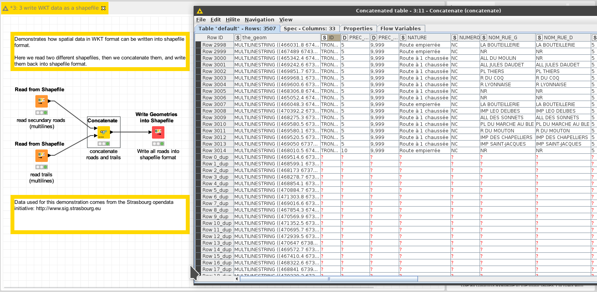

# Demo: write spatial data into a shapefile

[Download the workflow here](3_write_WKT_data_as_shapefile.knwf), then import it into KNIME using File/Import KNIME Workflow. 

This workflow demonstrates how to reproject the geometries.

# Things to try

* Change the location of the output file written by the "Write WKT as a Shapefile" node
* Run the workflow
* Open the resulting file with a [GIS sofware](https://en.wikipedia.org/wiki/Geographic_information_system) like [qgis](https://www.qgis.org), and check the data was merged well. Observe how the KNIME columns were stored into the file as well.

# Next

See the next demo on how to [convert KML into shapefile format](pages/4_transform_KML_into_shapefile/index.md). 
Or come back to [the documentation](../../).