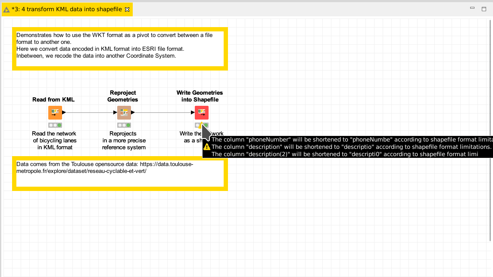

# Demo: convert KML data into shapefile format

[Download the workflow here](4_transform_KML_data_into_shapefile.knwf), then import it into KNIME using File/Import KNIME Workflow. 

This workflow demonstrates how to convert from one format of spatial data to another one using our collection of nodes; 
here we convert [KML data](https://en.wikipedia.org/wiki/Keyhole_Markup_Language) into [shapefile format](https://en.wikipedia.org/wiki/Shapefile). 

# Things to try

* change the location of the output file by tuning the "Write WKT as a Shapefile" configuration
* Run the workflow
* Observe the warnings emitted by the node: the ESRI shapefile format is a bit dated, and suffers many limitations in the column titles size, the count of columns and others. When these limitations are met, the node will adapt your data so it can be written and warn you.
* Open the resulting file with a [GIS sofware](https://en.wikipedia.org/wiki/Geographic_information_system) like [qgis](https://www.qgis.org), and check the data was written the right way.

# Next

Come back to [the documentation](../../).