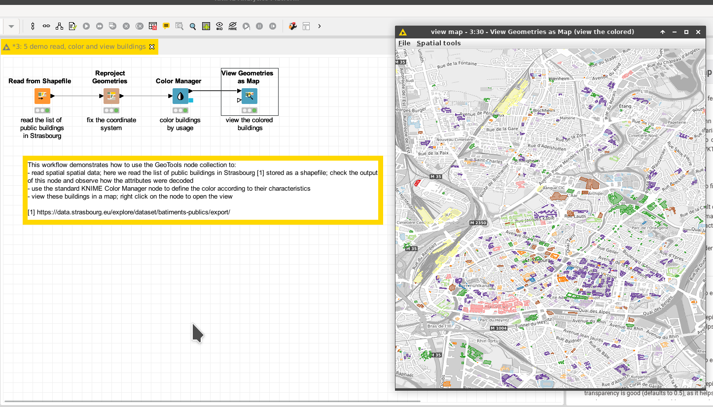

# Demo: Color Geometries using Color Manager

[Download the workflow here](5_demo_read_color_and_view_buildings.knwf), then import it into KNIME using File/Import KNIME Workflow. 

This workflow demonstrates how to use the [KNIME Color Manager node](https://nodepit.com/node/org.knime.base.node.viz.property.color.ColorManager2NodeFactory) to change the colors displayed in the spatial view. 

# Things to try

* Run the workflow
* Watch the output of the Color Manager
* Watch the view 
* Change the configuration of the color manager to color the entities based on another property
* Observe the changes

# Next

Check the next demo on [how to compute the surface of geometries](../../pages/6_compute_surface/index.md). 
Or come back to [the documentation](../../).