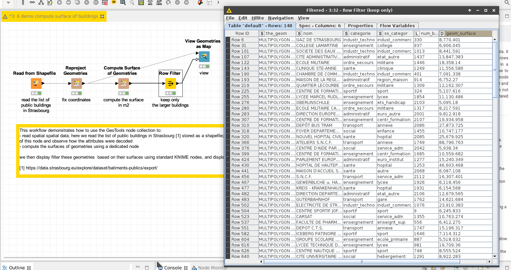

# Demo: convert KML data into shapefile format

[Download the workflow here](6_demo_compute_surface_of_buildings.knwf), then import it into KNIME using File/Import KNIME Workflow. 

This workflow demonstrates how to compute the surface of the building.
Note that this node, independantly of the Coordinate Reference System, will compute the surface in square meters.

# Things to try

* Run the workflow
* Check the output of the "Compute Surface" node, and check the figures for the surface.
* Observe the "Row filter" configuration 
* Open the view, and observe how only the biggest buildings (in blue) were kept among all the initial buildings (in gray).
* Change the configuration of the row filter to only keep the buildings bigger than 5,000 meters. 

# Next

Come back to [the documentation](../../).