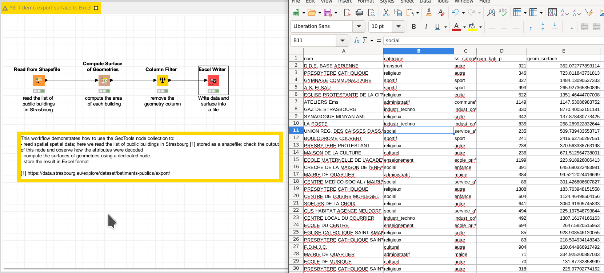

# Demo: extract shapefile attributes to Excel

[Download the workflow here](7_demo_export_surface_to_Excel.knwf), then import it into KNIME using File/Import KNIME Workflow. 

This workflow demonstrates how to read data from shapefile, compute the surface of these geometries,
and store the result in Excel format.

# Things to try

* Run the workflow
* Let the Excel file to open
* Compare the content of the KNIME tables and the content of the Excel file.

# Next

See the next demo on the [extraction of raster data in GeoTIFF format](../../pages/8_read_geotiff/index.md)
Or come back to [the documentation](../../).
