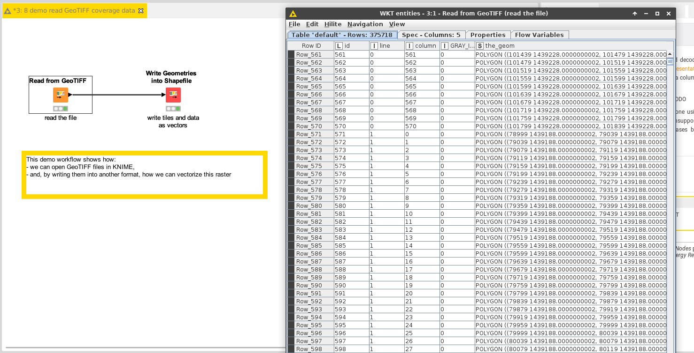

# Demo: extract raster data and vectorize it

[Download the workflow here](8_demo_read_GeoTIFF_and_vectorize.knwf), then import it into KNIME using File/Import KNIME Workflow. 

This workflow demonstrates how to read data from a raster file in GeoTIFF format.

# Things to try

* Run the workflow
* See how large the table is: extracting raster data leads to large tables 
* Open tge parameters of the GeoTIFF reades and test how unchecking some outputs, especially the geometry one, save time and space.

# Next

See the next demo on the [computation of the accessibility of buildings to services](../../pages/9_demo_accessibility_zones/index.md)
Or come back to [the documentation](../../).
