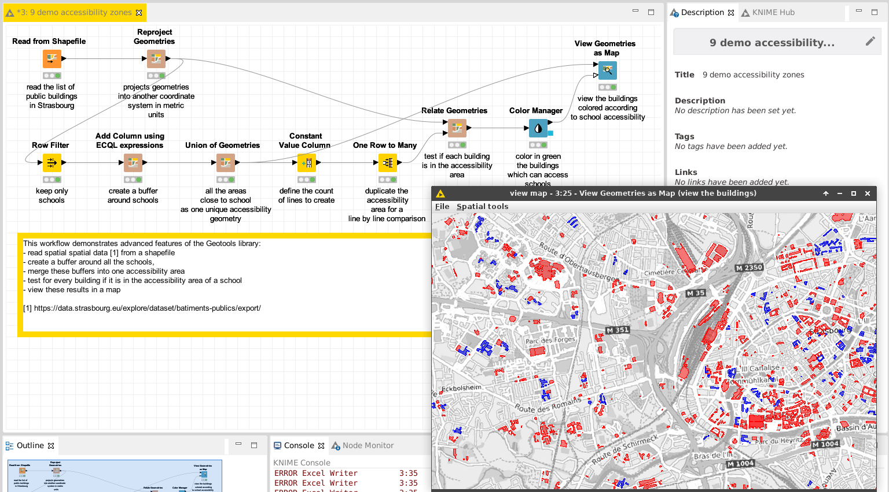

# Demo: compute the accessibility of buildings to services

[Download the workflow here](9_demo_accessibility_zones.knwf), then import it into KNIME using File/Import KNIME Workflow. 

This workflow demonstrates an advanced usage of the spatial features. 
We detect for every building if it can access a school. 

# Things to try

* Run the workflow
* Observe the results of the view, which displays in gray the area of accessibility of schools; in green the buildings which can access schools.
* Observe the outputs of the "Relate WKT Geometries"
* Try to adapt the size of the buffer in the "Add column using ECQL expressions" node

# Next

Come back to [the documentation](../../).